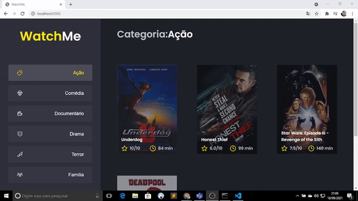

<h1>Watchme</h1>

 

> Sobre o Watchme

O Watchme é um projeto visando uma plataforma de acesso e exibição de filmes
no menu ao lado o usuário seleciona o gênero do filme e ao lado aparecem os filmes
que pertencem ao gênero escolhido.

 

> Tecnologias Ultilizadas

<ul>
  <li>React</li>
  <li>Typescript</li>
  <li>Javascript</li>
  <li>Html</li>
  <li>SASS</li>
</ul>

 
  
  
  
  
  

